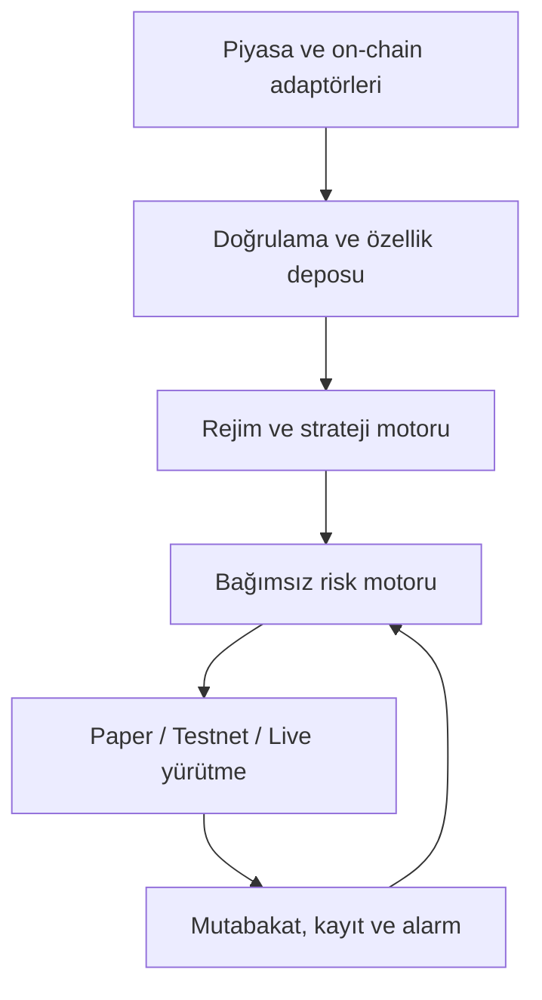

# Başlangıç mimarisi

## Tasarım hedefleri

1. Araştırma, risk ve emir iletimi birbirinden ayrılır.
2. Aynı strateji kodu backtest, paper ve testnet ortamlarında kullanılabilir.
3. Canlı yürütme, güvenli varsayılanlarla kapalıdır ve açıkça etkinleştirilir.
4. Her sinyalin kullanılan veri zamanı, model/strateji sürümü ve gerekçesi
   denetlenebilir biçimde kaydedilir.
5. Veri sağlayıcısı veya borsa değişimi strateji katmanını etkilemez.

## Planlanan bileşenler

## Güven sınırları

- Harici fiyat, order-book ve on-chain verileri güvenilmez girdi kabul edilir.
- ML çıktısı emir değil, yalnızca aday sinyaldir.
- Risk motoru stratejiden bağımsızdır ve emri küçültebilir veya reddedebilir.
- Yürütme katmanı idempotent istemci emir kimlikleri kullanır.
- Yerel pozisyon durumu ile borsa durumu düzenli olarak mutabık hale getirilir.
- Veri güncel değilse veya mutabakat bozulursa sistem yeni emir açmaz.

## İşlem modu durumları

| Mod | Gerçek borsa emri | Kimlik bilgisi | Amaç |
|---|---|---|---|
| `paper` | Hayır | Gerekmez | Geliştirme ve simülasyon |
| `testnet` | Test ortamı | Testnet anahtarı | Entegrasyon doğrulama |
| `live` | Evet | Kısıtlı canlı anahtar | Manuel olarak onaylanan üretim |

## İlk teknik kararlar

- Dil: Python 3.12+
- Paket yerleşimi: `src/`
- Test: `pytest` ve standart `unittest` uyumluluğu
- Kalite: Ruff, mypy, pip-audit
- CI: Her push ve pull request için GitHub Actions
- Başlangıç bağımlılıkları: Sıfır çalışma zamanı bağımlılığı; her ek bağımlılık ADR ile
  gerekçelendirilecek
